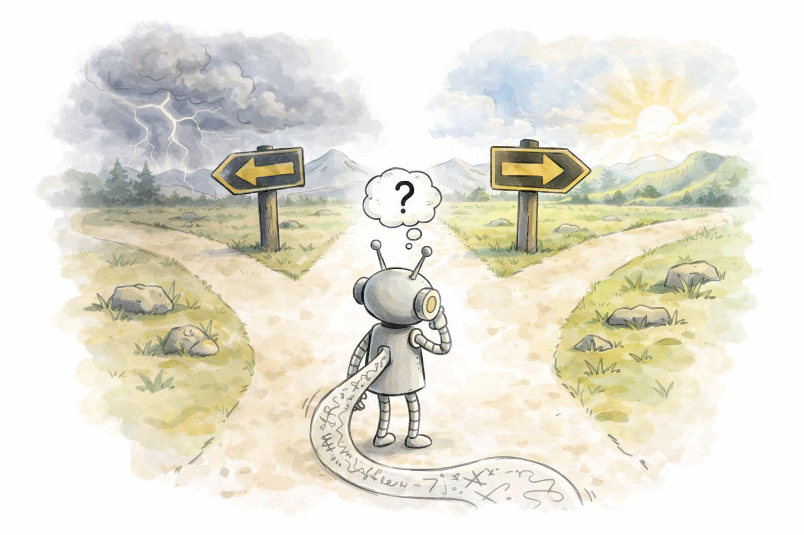

# Why Do Reasoning Models Lose Coverage? The Role of Data and Forks in the Road

[](https://opensource.org/licenses/MIT)
[](https://arxiv.org/abs/2605.17026)
[](./datasets/)
[](https://huggingface.co/datasets/nnheui/reasoning_modes)


Official Implementation of paper [**Why Do Reasoning Models Lose Coverage? The Role of Data and Forks in the Road**](https://arxiv.org/abs/2605.17026).
This repository includes all code for data generation, training pipelines, and evaluation.

<!-- ## 📌 Table of Contents
- [Overview](#overview)
- [Quick Start](#quick-start)
- [Installation](#installation)
- [Project Structure](#project-structure)
- [Datasets & Data Generation](#datasets--data-generation)
- [Training](#training)
  - [Supervised Fine-Tuning (SFT)](#supervised-fine-tuning-sft)
  - [Reinforcement Learning via Reasoning (RLVR)](#reinforcement-learning-via-reasoning-rlvr)
- [Inference & Evaluation](#inference--evaluation)
- [Key Experiments](#key-experiments)
- [Citation](#citation)
- [License](#license)

## Overview

*Why Do Reasoning Models Lose Coverage?*

In this paper, we revisit this open question with **a data-centric lens**, and show **how “forks in the road”** situations in the post-training data **can shape—and shrink—model coverage**. 

To test this, we design controlled environments that isolate and expose decision-points structures via (a) graph branching, and (b) reasoning mode selection. Our findings show that sharpening isn’t just about post-training algorithms it’s also deeply shaped by data and its design. We learned that:

- Decision points / “forks in the road” in data matter
- The structure of data diversity shapes behavior
- First tokens act as hidden control knobs for coverage

<!-- 
1. We present a systematic, data-centric study of coverage shrinkage in reasoning post-trained models, aiming to understand its underlying factors.
2. We identify **forks-in-the-road patterns** in fine-tuning data as a key driver of coverage shrinkage, and analyze this effect through targeted case studies such as graph branching and alternative mathematical reasoning strategies.
3. Through controlled experiments and training-dynamics analysis, we find a strong correlation between the structure of decision points in data and the severity of coverage shrinkage, providing empirical evidence for the role of data on such behavior.
4. Motivated by our findings, we introduce two simple diversity-aware data synthesis and decoding strategies, and present proof-of-concept results demonstrating their effectiveness in mitigating shrinkage. These results suggest that the lost coverage is not permanently forgotten, but instead suppressed, and can be recovered through inference-time intervention. -->




## Installation

We recommend using [`uv`](https://github.com/astral-sh/uv) for Python environment management and dependency installation.

```bash
# 1. Install uv (if you haven't already)
curl -LsSf [https://astral.sh/uv/install.sh](https://astral.sh/uv/install.sh) | sh

# 2. Create a virtual environment using Python 3.12
uv venv --python 3.12

# 3. Activate the environment
source .venv/bin/activate 

# 4. Install requirements
uv pip install -r requirements.txt
```


## Datasets
Below are the scripts used for generation of data used in each task: 

#### Graph Branching
Generate the 6,400 SFT training samples, 1600 RLVR training samples, and 1,000 test samples in the Alpaca instruction format.

```Bash
python src/data_generation/gen_arithchain.py
```

#### Mathematical Reasoning Modes
The subsets of `OpenMathInstruct-1` and `OpenMathInstruct-2` datasets used in our experiments to evaluate Data-level vs. Problem-level diversity for NL/Code reasoning modes are provided at huggingface: [`nnheui/reasoning_modes`](https://huggingface.co/datasets/nnheui/reasoning_modes).


#### CounterFactual Arithmetic
The base-7, 9, 11, and 12 counterfactual arithmetic datasets are used to test under-thinking reasoning behavior. This dataset is provided at: `src/data_generation/counterfact_arithmetic.ipynb`.

#### Simple knowledge questions - CapitalQA
The `CapitalQA` dataset is used to evaluate over-thinking reasoning behaviors on simple factual queries. This dataset is provided at: `datasets/capitalQA.json`.


## Training

### SFT
We use [Unsloth](https://unsloth.ai/) as the main framework for SFT runs. Here is an example command to run the 16-epoch SFT pipeline on graph branching task with `Qwen-2.5-0.5B` LLM backbone.

```Bash

bash run_sft.sh arithchain_2_10_forward qwen2.5_0.5b 16
```

### RLVR
You can also continue specific SFT checkpoints with RLVR using this script (this can be helpful for the SFT vs RLVR coverage shrinkage comparison; check our graph branching experiments in Figure 13 for details).

```Bash
bash run_grpo.sh
```


## Inference & Evaluation
Below is an example command for running experiments of the prefix-based sampling analysis. The same script can also be adapted for other inference experiments by modifying the configuration files.

### Step 1: Prepare Inference Jobs

```bash
bash prepare_sampling_distilled_models_prefix.sh
```

This script:
- Creates inference run directories for different prefixes
- Generates sampler config files for each task
  

**Current Configuration** (in the script):
- Model: DeepSeek-R1-Distill-Qwen-1.5B
- Datasets: Math500, AIME24, AIME25, GSM8K, ArithChain, Counterfactual, CapitalQA
- Prefixes tested: "Okay", "Let", "Alright", "To", and default (no prefix)


### Step 2: Run Batch Sampling with Multi-GPU Scheduling

```bash
bash spawn_sampling.sh
```

**Current Configuration** (in `spawn_sampling.sh`):
```bash
AVAILABLE_GPUS=(4 5 6 7)  # Configure your GPU IDs
```

**How it works**:
1. Reads `job_list.txt` to get sampling job specifications
2. Builds a queue of all pending tasks
3. Monitors GPU availability and dispatches jobs using `CUDA_VISIBLE_DEVICES`
4. Automatically starts new jobs as GPUs become idle
5. Tracks process IDs (PIDs) for job monitoring

**Expected output**:
- Generated samples in JSON format for each configuration
- Located in `inference_runs/` directory


### Step 3: Evaluate Pass@k Coverage

```bash
bash compute_passk.sh
```
This script computes Pass@k metrics for each inference run. It aggregates results into a summary json file for analysis.


## Key Experiments

### Experiment 1: Graph Branching & Decision Points
Our first evaluation setting is Graph Branching which is a natural testbed for studying the impact of “decision point” on coverage shrinkage. In this setting, we train the same model on the same task, with only ablating the reasoning solution and exposure to decision points throughout forward and reverse graph traversals. 


<!-- Experiments on graph branching case study is mainly focused on how the structure of **decision points** in training data affects coverage shrinkage. -->


#### Steps
1. Here are the example commands for running SFT on forward vs. reverse reasoning solutions, followed by RLVR on SFT checkpoints.

Qwen2.5-0.5B
```Bash
bash run_sft.sh arithchain_2_10_forward qwen2.5_0.5b
bash run_grpo.sh runs/reasoning_forks_sft/qwen2.5_0.5b_sft_arithchain_2_10_forward_lr1e-5_bs32_ga1/checkpoint-200 4

bash run_sft.sh arithchain_2_10_reverse qwen2.5_0.5b
bash run_grpo.sh runs/reasoning_forks_sft/qwen2.5_0.5b_sft_arithchain_2_10_reverse_lr1e-5_bs32_ga1/checkpoint-200 4
```

EvoLM-1B
```Bash
bash run_sft.sh arithchain_2_10_forward evolm_1b
bash run_grpo.sh runs/reasoning_forks_sft/evolm_1b_sft_arithchain_2_10_forward_lr1e-5_bs32_ga1/checkpoint-200 4

bash run_sft.sh arithchain_2_10_reverse evolm_1b
bash run_grpo.sh runs/reasoning_forks_sft/evolm_1b_sft_arithchain_2_10_reverse_lr1e-5_bs32_ga1/checkpoint-200 4
```


2. Compute pass@k for each intermediate checkpoint throughout the training 

```Bash
bash prepare_sampling_synthetic.sh
bash bash spawn_sampling.sh
bash compute_passk.sh
```


### Experiment 2: First Token Matters More than You’d Think! (Linear and Backtracking Reasoning Modes)
Our next evaluation testbed is Reasoning Mode Selection between the  Linear vs Backtracking thinking structure. We observe that with manipulation of only ONE token, changing first token (”Okay" → “To”), we can significantly change the model’s reasoning behavior and the corresponding performance. 

Below is an example of command that tests different reasoning prefixes (hidden control knobs) and their influence on reasoning behavior.

```bash
bash prepare_sampling_distilled_models_prefix.sh
bash spawn_sampling.sh
bash compute_passk.sh
```


### Experiment 3: The Important Role of Data Diversity Structure
We also study NL vs Code reasoning mode selection as another decision point setting. In this experiment, we asked: does data diversity affect post-training coverage? and how?
To study this, we trained models on NL/Code data mix in two ways: 1) diversity spread across problems (data-level diversity); and 2) diversity within each problem (problem-level diversity). 


Here are example commands to run SFT on datasets with data-level vs. problem-level reasoning diversity and analyze its impact on coverage.


<!-- **Steps**: -->

SFT on GSM8K-based datasets with controlled diversity

```Bash
bash run_sft.sh gsm8k_datasetlevel qwen2.5_0.5b 8
bash run_sft.sh gsm8k_problemlevel qwen2.5_0.5b 8

bash run_sft.sh gsm8k_datasetlevel evolm-1b 8
bash run_sft.sh gsm8k_problemlevel evolm-1b 8

bash run_sft.sh gsm8k_datasetlevel evolm-4b 8
bash run_sft.sh gsm8k_problemlevel evolm-4b 8
```

<!-- 2. Evaluation Pass@k and measure distribution of code-based solutions -->


### Experiment 4: Data-inspired Shrinkage Mitigation

If first tokens act as decision points, can we use them to recover lost coverage? In this experiment, we enforce perturbation in the sampling of first token among top-k options instead of the standard decoding (without the need for retraining!). We observe that it can effectively nudge the model into different reasoning paths, and significantly restore their lost coverage.

To replicate these experiments, configure your `sampler_config.yaml` as follows. Make sure to substitute `${ckpt_dir}` with the path to your checkpoint.

```yaml
sampler:
  class: DiverPathVLLMSampler
  model_name: ${ckpt_dir}
  first_topk: 8
  max_logprobs: 64
  temperature: 1.0
  top_p: 0.95
  top_k: -1
  max_tokens: 1024
```

<!-- To study how inference-time prefixing affect coverage This setup replicates the inference-time prefixing experiment.  -->


## Citation
If you find this repo or our findings useful in your research, please cite us with:
<pre>
@article{hieu2026reasoningforks,
  title={Why Do Reasoning Models Lose Coverage? The Role of Data and Forks in the Road}, 
  author={Ngoc-Hieu Nguyen and Parshin Shojaee and Phuc Minh Nguyen and Nan Zhang and Chandan K Reddy and Khoa D Doan and Rui Zhang},
  year={2026},
  eprint={2605.17026},
  archivePrefix={arXiv},
  primaryClass={cs.LG},
  url={https://arxiv.org/abs/2605.17026}, 
}
</pre>


## License 
This repository is licensed under MIT licence.

This work is built on top of other open source projects, including [Search-R1](https://github.com/PeterGriffinJin/Search-R1), [nano-aha-moment
](https://github.com/McGill-NLP/nano-aha-moment), [counterfactual-evaluation]( https://github.com/ZhaofengWu/counterfactual-evaluation/tree/master/arithmetic), [Next-Token-Failures](https://github.com/gregorbachmann/Next-Token-Failures), and [
limit-of-RLVR](https://github.com/LeapLabTHU/limit-of-RLVR). We thank the original contributors of these works for open-sourcing their valuable source codes. 


## Contact Us
For any questions or issues, you are welcome to open an issue in this repo, or contact us at [hnn5071@psu.edu](mailto:hnn5071@psu.edu).


